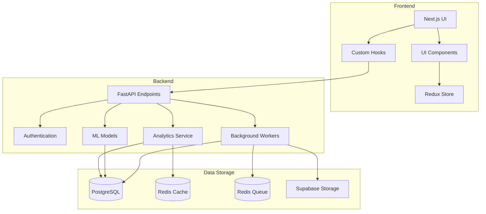
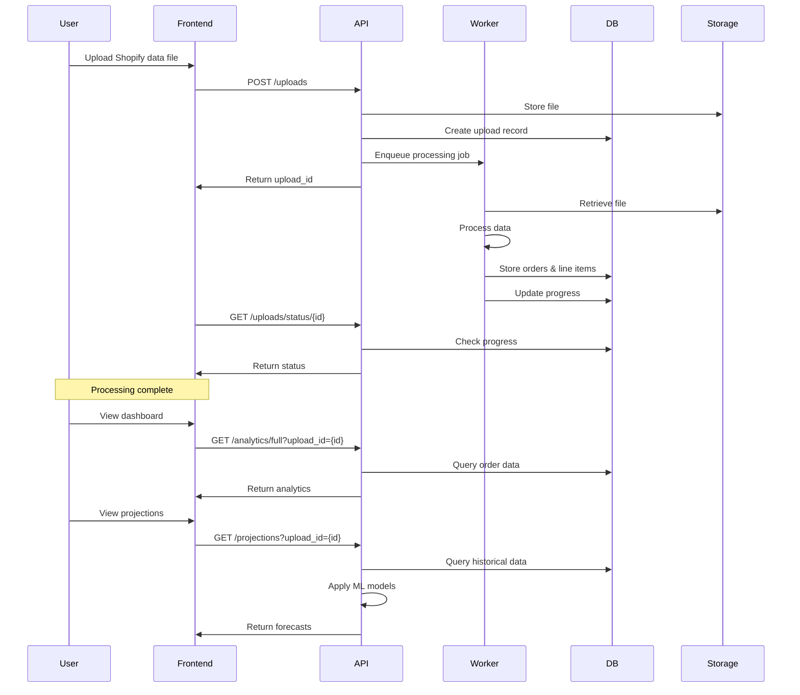
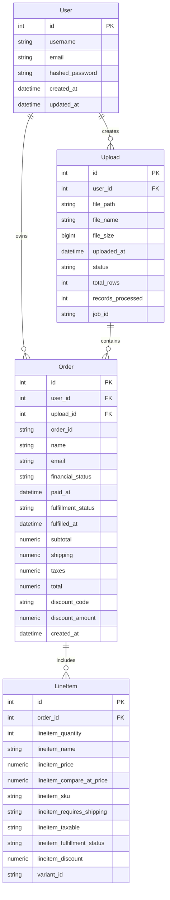
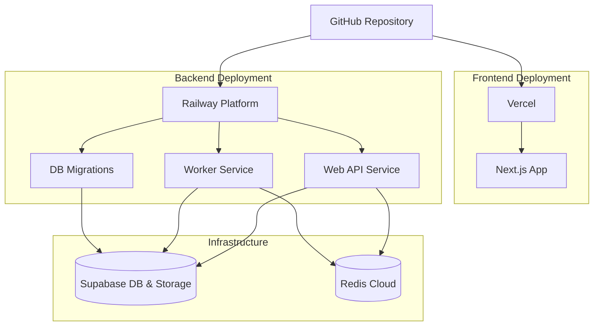

# Shopify Analytics Application

## Overview

The Shopify Analytics Application is a comprehensive data analytics platform designed for Shopify store owners to process, visualize, and forecast their order data. The application provides powerful insights into sales performance, customer behavior, and product trends, enabling data-driven decision making for e-commerce businesses.

## System Architecture

## Key Features

### Data Ingestion & Processing

- **Efficient Bulk Data Upload**: Process large Shopify order exports (~13,000 records) in under 30 seconds
- **Real-time Progress Tracking**: Monitor file upload and processing status with live progress indicators
- **Background Processing**: Asynchronous task queue for handling large data imports without blocking the UI
- **Multiple File Format Support**: Compatible with CSV and Excel (XLSX) file formats

### Analytics Dashboard

- **Comprehensive KPIs**: Pre-built analytics covering orders, revenue, products, customers, and geography
- **Customizable Views**: Toggle between default and custom dashboard modes to focus on specific metrics
- **Interactive Visualizations**: Dynamic charts and graphs for time-series data, geographic distribution, and more
- **Historical Data Access**: Switch between different data uploads to compare performance over time

### Machine Learning Forecasting

- **Sales Projections**: Predict future sales volume and revenue based on historical patterns
- **Style-Based Forecasting**: Analyze product style trends to inform inventory and merchandising decisions
- **Multiple Forecasting Models**: Choose between simple seasonal models and more sophisticated ARIMA models
- **Confidence Intervals**: Understand the reliability of predictions with built-in confidence metrics

### User Management

- **Secure Authentication**: JWT-based authentication system with NextAuth.js integration
- **User-Specific Data**: Each user can only access their own uploads and analytics
- **Account Management**: User profile and settings management

## Data Flow

## Technical Architecture

### Backend Architecture

The backend is built with a modern, scalable architecture:

- **FastAPI Framework**: High-performance Python web framework for building APIs
- **SQLAlchemy ORM**: Object-Relational Mapping for database interactions
- **PostgreSQL Database**: Relational database for structured data storage
- **Redis Cache & Queue**: In-memory data store for caching and task queue management
- **RQ (Redis Queue)**: Background worker system for processing uploads and generating analytics
- **Alembic Migrations**: Database schema version control and migration management
- **Supabase Integration**: Cloud database and storage solution

#### Core Components

1. **API Layer**: RESTful endpoints organized by resource and version
   - User authentication and management
   - File upload and processing
   - Analytics data retrieval
   - Forecasting and projections

2. **Database Models**:
   - `User`: Store user accounts and authentication details
   - `Upload`: Track file uploads, processing status, and metadata
   - `Order`: Store Shopify order data with comprehensive fields
   - `LineItem`: Individual products within orders with pricing and quantity

3. **Analytics Service**:
   - Aggregation functions for various KPIs and metrics
   - Caching system for improved performance
   - Registry pattern for extensible analytics modules

4. **Machine Learning Models**:
   - Time series forecasting for overall sales trends
   - Style-based forecasting for product category analysis
   - Data preparation and feature engineering pipelines

5. **Background Processing**:
   - Worker processes for handling long-running tasks
   - Job scheduling and monitoring
   - Error handling and retry mechanisms

### Frontend Architecture

The frontend is built with a modern React stack:

- **Next.js Framework**: React framework with server-side rendering capabilities
- **Material-UI Components**: Comprehensive UI component library
- **TanStack Query**: Data fetching, caching, and state management
- **Redux Store**: Global state management for cross-component data
- **Recharts**: Flexible charting library for data visualization
- **Axios**: HTTP client for API communication

#### Key Frontend Components

1. **Page Components**:
   - Dashboard: Display analytics and KPIs
   - Upload: File upload interface with progress tracking
   - Projections: Sales forecasting and trend analysis
   - Historical: View and manage previous uploads
   - Account: User profile and settings

2. **Reusable UI Components**:
   - `KPICard`: Display individual metrics with appropriate formatting
   - `KPILineChart`: Time-series visualization component
   - `ForecastChart`: Display sales projections with confidence intervals
   - `StyleForecastChart`: Visualize product style trends
   - `AggregatorBlock`: Dynamic component for rendering different KPI types

3. **Custom Hooks**:
   - `useUpload`: Handle file uploads and progress tracking
   - `useAnalyticsFull`: Fetch complete analytics data
   - `useAnalyticsCustom`: Fetch specific analytics metrics
   - `useHistoricalUploads`: Retrieve previous upload history
   - `useProjections`: Generate and retrieve sales forecasts

## Database Schema

## Deployment Architecture

The application uses a modern cloud-native deployment approach:

### Deployment Components

1. **Web API Service**: Handles HTTP requests and API endpoints
2. **Worker Service**: Processes background jobs and long-running tasks
3. **Database Migrations**: Automatically run during deployment
4. **Frontend Application**: Static site with server-side rendering capabilities

## Security Features

- **JWT Authentication**: Secure token-based authentication
- **Password Hashing**: Bcrypt algorithm for password security
- **Environment Variable Management**: Secure handling of credentials and secrets
- **CORS Protection**: Cross-Origin Resource Sharing restrictions
- **Input Validation**: Request validation to prevent injection attacks
- **Rate Limiting**: Protection against brute force and DoS attacks

## Performance Optimizations

- **Redis Caching**: Frequently accessed analytics are cached to reduce database load
- **Background Processing**: Long-running tasks are offloaded to worker processes
- **Query Optimization**: Efficient database queries with proper indexing
- **Pagination**: Large datasets are paginated to improve response times
- **Lazy Loading**: Components and data are loaded only when needed

## Available Analytics

| Category | Metric | Description |
|----------|--------|-------------|
| Orders | Orders Summary | Total orders, total revenue, and average order value |
| Orders | Daily Time Series | Number of orders per day over time |
| Orders | Hourly Orders | Orders grouped by hour of the day |
| Orders | Orders by Day of Week | Orders grouped by day of week |
| Customers | Repeat Customer Metrics | Unique customers, repeat customers, and repeat rate |
| Geography | Top Cities by Orders | Ranking of cities by order count |
| Geography | Top Cities by Revenue | Ranking of cities by total revenue |
| Products | Top Products by Quantity | Most popular products by quantity sold |
| Products | Top Products by Revenue | Highest revenue-generating products |
| Discounts | Top Discount Codes | Most frequently used discount codes |
| Discounts | Top Discount Codes by Savings | Discount codes with highest total savings |

## Conclusion

The Shopify Analytics Application provides a comprehensive solution for e-commerce businesses to analyze their sales data and make data-driven decisions. With its powerful analytics, forecasting capabilities, and user-friendly interface, it enables store owners to gain valuable insights into their business performance and plan for future growth.

The application's modern architecture ensures scalability, performance, and security, while its extensible design allows for future enhancements and customizations to meet evolving business needs.
