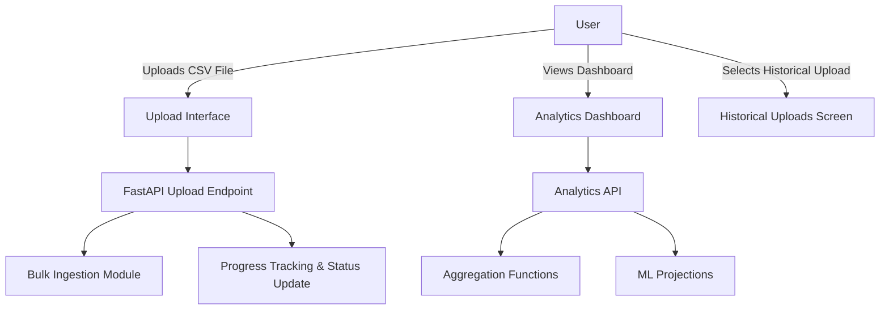
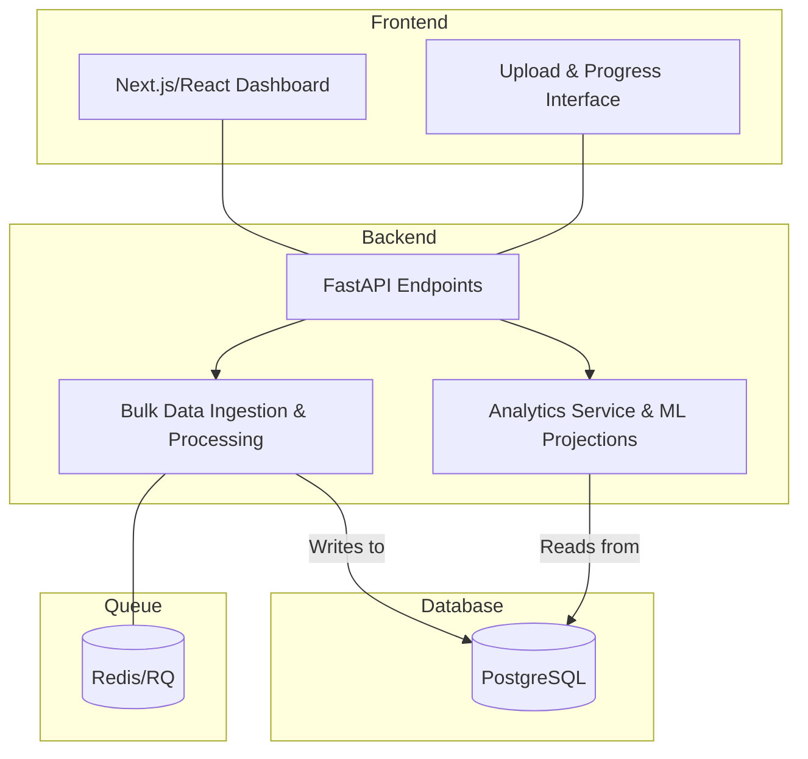

# CMSI 4072: Senior Project II

# Software Design Description

---

## Table of Contents

1. [6.1 Introduction](#61-introduction)
   - [6.1.1 System Objectives](#611-system-objectives)
   - [6.1.2 Hardware, Software, and Human Interfaces](#612-hardware-software-and-human-interfaces)
2. [6.2 Architectural Design](#62-architectural-design)
   - [6.2.1 Major Software Components](#621-major-software-components)
   - [6.2.2 Major Software Interactions](#622-major-software-interactions)
   - [6.2.3 Architectural Design Diagrams](#623-architectural-design-diagrams)
3. [6.3 CSC and CSU Descriptions](#63-csc-and-csu-descriptions)
   - [6.3.1 Detailed Class Descriptions](#631-detailed-class-descriptions)
     - [6.3.1.1 Detailed Class Description: Order](#6311-detailed-class-description-order)
     - [6.3.1.2 Detailed Class Description: Upload](#6312-detailed-class-description-upload)
     - [6.3.1.3 Detailed Class Description: User](#6313-detailed-class-description-user)
     - [6.3.1.4 Detailed Class Description: LineItem](#6314-detailed-class-description-lineitem)
     - [6.3.1.5 Detailed Class Description: Analytics Functions](#6315-detailed-class-description-analytics-functions)
   - [6.3.2 Detailed Interface Descriptions](#632-detailed-interface-descriptions)
   - [6.3.3 Detailed Data Structure Descriptions](#633-detailed-data-structure-descriptions)
   - [6.3.4 Detailed Design Diagrams](#634-detailed-design-diagrams)
4. [6.4 Database Design and Description](#64-database-design-and-description)
   - [6.4.1 Database Design ER Diagram](#641-database-design-er-diagram)
   - [6.4.2 Database Access](#642-database-access)
   - [6.4.3 Database Security](#643-database-security)
5. [Appendices](#appendices)

---

## 6.1 Introduction

This document presents the architecture and detailed design for the Shopify Analytics App. The system is designed to process Shopify export files, aggregate analytics data (with integrated machine learning projections), and serve dynamic dashboards. The primary focus is on the backend (including machine learning), the database, and finally the frontend.

### 6.1.1 System Objectives

- **Objective:** The application will efficiently import large Shopify export files (up to and beyond 13,000 records) by employing bulk data ingestion techniques.
- **Analytics:** It will aggregate and present comprehensive analytics data in both a default mode (all KPIs) and a custom KPI selection mode.
- **Machine Learning:** Integrated machine learning algorithms will generate projections based on historical data.
- **Historical Uploads:** Users will be able to select and view historical uploads.
- **User Interface:** The Next.js/React frontend will deliver a responsive dashboard and a file upload interface with real-time progress tracking.

### 6.1.2 Hardware, Software, and Human Interfaces

#### 6.1.2.1 Hardware Interfaces

- **General:** The application is developed and deployed locally (using a client laptop) and on servers managed via Docker. No specialized hardware interfaces are required beyond standard keyboard, mouse, and display devices.

#### 6.1.2.2 Software Interfaces

- **Backend Interfaces:** RESTful HTTP/HTTPS APIs provided by FastAPI, documented via Swagger.
- **Libraries & Frameworks:** FastAPI, SQLAlchemy, Alembic, Pandas, Redis/RQ, Next.js, React, Material‑UI, @tanstack/react-query, Axios.
- **Protocols:** Data is exchanged using JSON over HTTP.

#### 6.1.2.3 Human Interfaces

- The system provides a modern, responsive GUI. The primary screens are:
  - **Upload Screen:** Allows users to select and upload Shopify export files. A progress bar and percentage indicator are shown during processing.
  - **Dashboard:** Displays analytics in the form of KPI cards, line charts, and tables with both default and custom KPI modes.
  - **Historical Uploads:** Offers a dropdown to select and review previous uploads.
- Usability considerations include intuitive navigation and immediate feedback upon file upload.

---

## 6.2 Architectural Design

The system is partitioned into the following main components:

### 6.2.1 Major Software Components

- **Backend (FastAPI):**  
  Handles file uploads, bulk data ingestion, progress tracking, analytics aggregation, and integrated machine learning projections.
- **Machine Learning Module:**  
  Integrated within the backend to generate future projections based on historical data.
- **Database (PostgreSQL):**  
  Stores all persistent data including Users, Uploads, Orders, and LineItems, with support for bulk inserts and query indexing.
- **Frontend (Next.js/React):**  
  Displays the file upload interface (with real-time progress) and the analytics dashboard. Utilizes TanStack Query for data fetching and Axios for API communication.

### 6.2.2 Major Software Interactions

Components interact primarily through RESTful endpoints:

- The **Frontend** uploads files to the **Backend**; the backend enqueues tasks via Redis/RQ.
- The **Backend** processes files by ingesting data into the **Database** (using bulk inserts) and updates progress fields.
- The **Frontend** polls the **Backend** (using a specific status endpoint) to display real-time progress.
- The **Analytics API** aggregates data from the **Database** and, when applicable, integrates machine learning projections.
- The **Machine Learning Module** processes historical data and outputs projections that are merged into analytics results.

### 6.2.3 Architectural Design Diagrams

#### Use Case Diagram



#### Component Diagram


#### Sequence Diagram for File Upload

```mermaid
sequenceDiagram
    participant U as User
    participant FS as Frontend (Upload)
    participant API as FastAPI Endpoint
    participant Q as Redis Queue
    participant DB as PostgreSQL
    participant ML as ML Module

    U->>FS: Selects file and clicks "Upload"
    FS->>API: POST /uploads/ with file & metadata
    API->>DB: Creates Upload record
    API->>Q: Enqueues file processing task
    Q->>API: process_shopify_file_task(file_location, user_id, upload_id)
    API->>DB: Bulk insert orders & line items; update records_processed
    DB-->>API: Upload progress updated
    API->>ML: Generate ML projections (integrated)
    API-->>FS: Returns upload_id and job_id
    FS->>API: GET /uploads/status/{upload_id} (polling)
    API->>DB: Query upload progress
    DB-->>API: Returns current status and percent
    API-->>FS: Sends status and progress (e.g., "processing", 42%)
```

#### Deployment Diagram

```mermaid
graph TD
    A[Client Browser (Next.js/React)] -- HTTP Requests --> B[FastAPI Backend]
    B -- CRUD Operations --> C[(PostgreSQL)]
    B -- Background Processing --> D[(Redis/RQ)]
    B -- ML Projections --> E[ML Module]
    subgraph Local Hosting
      B
      C
      D
      E
    end
```

---

## 6.3 CSC and CSU Descriptions

### 6.3.1 Detailed Class Descriptions

#### 6.3.1.1 Detailed Class Description: Order

- **Class Name:** `Order`
- **Purpose:** Represents an individual Shopify order. It stores key order-level information such as order identifier, customer name, email, monetary amounts, and timestamps, and is linked to one or more line items.
- **Fields:**
  - `id`: Primary key.
  - `user_id`: References the user.
  - `upload_id`: References the upload record.
  - `order_id`: Shopify order identifier.
  - `name`: Order name or identifier (required).
  - `email`: Customer email (required).
  - Monetary Fields: `subtotal`, `shipping`, `taxes`, `total` (stored as Numeric).
  - Additional Fields: Payment, shipping, and billing details; timestamps.
- **Methods:**
  - CRUD operations (via SQLAlchemy and helper CRUD functions).

#### 6.3.1.2 Detailed Class Description: Upload

- **Class Name:** `Upload`
- **Purpose:** Captures file upload metadata and tracks processing progress.
- **Fields:**
  - `id`: Primary key.
  - `user_id`: References the user.
  - `file_path`, `file_name`, `file_size`: Metadata for the uploaded file.
  - `uploaded_at`: Timestamp of when the file was uploaded.
  - `status`: Processing status (e.g., "pending", "processing", "completed", "failed").
  - `total_rows`: Total number of records in the file.
  - `records_processed`: Number of records processed so far.
- **Methods:**
  - CRUD operations for Upload records.

#### 6.3.1.3 Detailed Class Description: User

- **Class Name:** `User`
- **Purpose:** Represents a registered user in the application.
- **Fields:**
  - `id`, `username`, `email`, `hashed_password`, and timestamp fields.
- **Methods:**
  - User authentication and related CRUD operations.

#### 6.3.1.4 Detailed Class Description: LineItem

- **Class Name:** `LineItem`
- **Purpose:** Represents a line item associated with an order.
- **Fields:**
  - `id`: Primary key.
  - `order_id`: Foreign key linking to the Order.
  - Attributes: `lineitem_quantity`, `lineitem_name`, `lineitem_price`, `lineitem_discount`, etc.
- **Methods:**
  - Basic CRUD operations, with cascade delete on order removal.

#### 6.3.1.5 Detailed Class Description: Analytics Functions

- **Module:** Analytics Service Functions
- **Purpose:** Provide functions to aggregate order data for the dashboard and perform machine learning–based projections.
- **Key Functions:**
  - `get_orders_summary(db, user_id, upload_id)`: Aggregates order count, total revenue, and average order value.
  - `get_time_series(db, user_id, upload_id)`: Creates a time-series aggregation of orders.
  - Other functions include top products, top cities, repeat customers, and discount code analytics.
  - Integrated functions that apply machine learning projections to historical data.

### 6.3.2 Detailed Interface Descriptions

- **REST API Interfaces:**
  - Endpoints for file upload (`POST /uploads/`), upload progress (`GET /uploads/status/{upload_id}`), analytics (`GET /analytics/full` and `/analytics/custom`), and historical uploads (`GET /uploads/history`).
  - Data is exchanged via JSON over HTTP.
- **Module Interfaces:**
  - The backend processing module, including the bulk ingestion function (`process_shopify_file`), is invoked asynchronously via Redis/RQ.
  - Analytics functions are structured as a service layer callable by the API endpoints.

### 6.3.3 Detailed Data Structure Descriptions

- **Order Structure:** A dictionary with keys like `order_id`, `name`, `email`, `subtotal`, `shipping`, `taxes`, `total`, and additional fields.
- **Upload Structure:** Contains file metadata along with `status`, `total_rows`, and `records_processed`.
- **LineItem Structure:** Contains line item details such as quantity, name, price, and discount.
- **Analytics Result Structure:** Nested JSON objects and arrays representing aggregated metrics (e.g., orders summary, time series data, etc.).

### 6.3.4 Detailed Design Diagrams

#### Use Case Diagram


#### Component Diagram



#### Sequence Diagram (File Upload Interaction)

```mermaid
sequenceDiagram
    participant U as User
    participant FS as Frontend (Upload)
    participant API as FastAPI Endpoint
    participant Q as Redis Queue
    participant DB as PostgreSQL
    participant ML as ML Module

    U->>FS: Selects file and clicks "Upload"
    FS->>API: POST /uploads/ with file & metadata
    API->>DB: Creates Upload record
    API->>Q: Enqueues file processing task
    Q->>API: process_shopify_file_task(file_location, user_id, upload_id)
    API->>DB: Bulk insert orders & line items; update records_processed
    DB-->>API: Order data updated & progress recorded
    API->>ML: (Optionally) invoke ML projections
    API-->>FS: Returns upload_id and job_id
    FS->>API: GET /uploads/status/{upload_id} (polling)
    API->>DB: Query Upload progress
    DB-->>API: Returns current status and percentage
    API-->>FS: Sends status (e.g., "processing") and progress (e.g., 42%)
```

#### Deployment Diagram

```mermaid
graph TD
    A[Client Browser (Next.js/React)] -- HTTP Requests --> B[FastAPI Backend]
    B -- CRUD Operations --> C[(PostgreSQL)]
    B -- Background Processing --> D[(Redis/RQ)]
    B -- ML Projections --> E[ML Module]
    subgraph Local Hosting (Docker)
      B
      C
      D
      E
    end
```

---

## 6.4 Database Design and Description

### 6.4.1 Database Design ER Diagram

```mermaid
erDiagram
    USER ||--o{ UPLOAD : "owns"
    USER ||--o{ ORDER : "places"
    UPLOAD ||--o{ ORDER : "contains"
    ORDER ||--|{ LINE_ITEM : "has"

    USER {
      int id PK
      string username
      string email
      string hashed_password
      datetime created_at
      datetime updated_at
    }

    UPLOAD {
      int id PK
      int user_id FK
      string file_path
      string file_name
      bigint file_size
      datetime uploaded_at
      string status
      int total_rows
      int records_processed
    }

    ORDER {
      int id PK
      int user_id FK
      int upload_id FK
      string order_id
      string name
      string email
      numeric subtotal
      numeric shipping
      numeric taxes
      numeric total
      ... additional order fields ...
    }

    LINE_ITEM {
      int id PK
      int order_id FK
      int lineitem_quantity
      string lineitem_name
      string lineitem_price
      numeric lineitem_discount
      ... additional line item fields ...
    }
```

### 6.4.2 Database Access

- **ORM:** SQLAlchemy is used for all database interactions.
- **Connection:** FastAPI obtains database sessions through a SessionLocal factory.
- **Bulk Operations:** The system uses SQLAlchemy’s `bulk_insert_mappings` for efficient bulk inserts, especially during file ingestion.
- **Queries:** Aggregated analytics are performed via SQL functions (e.g., SUM, COUNT) and custom ORM queries.

### 6.4.3 Database Security

- The database employs role-based access controls and secured connection credentials.
- Authentication is enforced on API endpoints via token-based methods (such as JWT).
- Sensitive data (e.g., user passwords) is stored securely using hashing.
- Network-level controls ensure that only authorized services can access the PostgreSQL server.

---

## Appendices

- Detailed architectural diagrams and interaction sequences.
- API documentation generated by Swagger (via FastAPI).
- Performance and profiling reports for bulk data ingestion and ML projection modules.
- User guides and installation instructions for Docker/NPM deployment.
