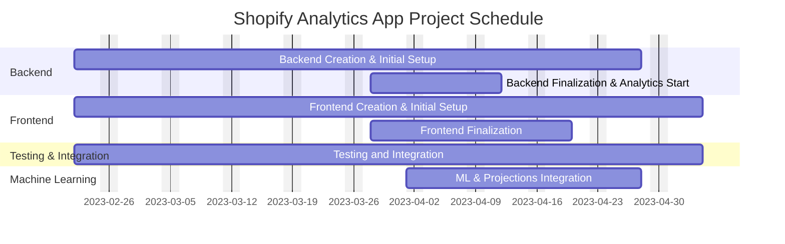

# CMSI 4072: Senior Project II

# Software Development Plan

---

## Table of Contents

1. [4.1 SDP Plan Introduction](#41-sdp-plan-introduction)
   - [4.1.1 Project Deliverables](#411-project-deliverables)
2. [4.2 Project Resources](#42-project-resources)
   - [4.2.1 Software Resources](#421-software-resources)
3. [4.3 Project Organization/Human Resources](#43-project-organizationhuman-resources)
4. [4.4 Project Schedule](#44-project-schedule)
   - [4.4.1 PERT / GANTT Chart](#441-pert--gantt-chart)
   - [4.4.2 Task/Resource Table](#442-taskresource-table)
   - [4.4.3 Class Schedule (Optional)](#443-class-schedule-optional)
5. [Appendices](#appendices)

---

## 4.1 SDP Plan Introduction

This Software Development Plan outlines the planned development for the Shopify Analytics App. This application is designed to efficiently process large Shopify export files, generate comprehensive analytics dashboards—including machine learning projections—and provide a user-friendly interface for both default and custom KPI views along with historical upload management.

**Project Overview:**  
The project includes backend API development, performance enhancements for bulk ingestion (processing approximately 13k records in ~30 seconds), and a dynamic Next.js/React frontend that displays analytics data and real-time upload progress. The system is built using FastAPI, PostgreSQL, Redis/RQ, and integrates machine learning components to produce future projections based on historical data. This includes both general sales forecasting and style-based forecasting that analyzes product categories to predict future sales trends by style.

### 4.1.1 Project Deliverables

- **Deliverable 1: Backend Creation and Initial Setup**  
  _Delivery Dates:_ 02/22 - 04/08  
  _Description:_ Develop the initial backend using FastAPI, SQLAlchemy, Alembic, and PostgreSQL. This includes setting up CRUD operations, file ingestion endpoints, and basic analytics aggregation functions.

- **Deliverable 2: Backend Finalization and Analytics Start**  
  _Delivery Dates:_ 03/28 - 04/08  
  _Description:_ Finalize the backend by integrating advanced analytics functions, bulk data ingestion with progress tracking, and background processing using Redis/RQ.

- **Deliverable 3: Frontend Creation and Initial Setup**  
  _Delivery Dates:_ 02/22 - 04/14  
  _Description:_ Develop the initial Next.js/React frontend, including the dashboard, file upload interface with progress tracking (Snackbar with progress bar), and basic navigation components (Navbar).

- **Deliverable 4: Frontend Finalization**  
  _Delivery Dates:_ 03/28 - 04/14  
  _Description:_ Finalize frontend functionality by integrating custom KPI selection, historical uploads view, and refined dashboard components.

- **Deliverable 5: Testing and Integration**  
  _Delivery Dates:_ 02/22 - 04/14  
  _Description:_ Execute comprehensive testing of all components (backend API, bulk data ingestion, frontend functionality) including performance and integration tests.

- **Deliverable 6: Machine Learning and Projections**  
  _Delivery Date:_ Completed  
  _Description:_ Integrate machine learning modules that use historical data to generate projections and additional insights, enhancing overall analytics. This includes both general time series forecasting and style-based forecasting for product categories.

---

## 4.2 Project Resources

Since hardware is not a primary concern (development will occur on a client laptop), the focus is on the necessary software.

### 4.2.1 Software Resources

- **Development Tools:**

  - Visual Studio Code
  - Docker
  - DBeaver
  - Swagger (for API documentation)

- **Languages & Frameworks:**

  - Python (FastAPI, SQLAlchemy, Alembic)
  - JavaScript/TypeScript (Next.js, React)
  - Machine Learning: NumPy, Pandas for data processing and forecasting

- **Database:**

  - PostgreSQL

- **Task Queue and Caching:**

  - Redis and RQ

- **Additional Libraries:**

  - Pandas for CSV processing
  - @tanstack/react-query for data fetching
  - Axios for HTTP requests

- **Deployment:**
  - Vercel (for frontend deployment)

---

## 4.3 Project Organization/Human Resources

- **CTO (Developer):** Carter Esparza

  - Responsible for overall project architecture, backend and frontend coding, integration of analytics, and machine learning projections.

- **CFO (Advisor):** Samuel Nielsen
  - Provides oversight on budgeting, resource planning, and assists with project documentation.

---

## 4.4 Project Schedule

Given that there is no fixed timeline beyond our deliverable windows, key time periods have been identified with overlapping development phases.

### 4.4.1 PERT / GANTT Chart

Below is a sample Mermaid Gantt chart illustrating the main phases and milestones:

_Note: Adjust the dates as needed._

### 4.4.2 Task/Resource Table

| **Task Name**                  | **Assigned Resource(s)**  | **Software Requirements**                                   | **Duration**  |
| ------------------------------ | ------------------------- | ----------------------------------------------------------- | ------------- |
| Backend Initial Setup          | Carter Esparza (CTO)      | FastAPI, SQLAlchemy, PostgreSQL, Alembic                    | 02/22 - 04/08 |
| Backend Finalization           | Carter Esparza (CTO)      | FastAPI, SQLAlchemy, Redis/RQ, advanced analytics functions | 03/28 - 04/08 |
| Frontend Initial Setup         | Carter Esparza (CTO)      | Next.js, React, Material‑UI, @tanstack/react-query, Axios   | 02/22 - 04/14 |
| Frontend Finalization          | Carter Esparza (CTO)      | Next.js, React, responsive dashboard components             | 03/28 - 04/14 |
| Testing & Integration          | Carter Esparza (CTO) / QA | Unit tests, integration tests, performance profiling        | 02/22 - 04/14 |
| Machine Learning & Projections | Carter Esparza (CTO)      | Python ML libraries, Pandas, NumPy, forecasting algorithms  | Completed     |

### 4.4.3 Class Schedule (Optional)

- **Week 1 (Feb 22):** Project kickoff, requirements review, initial setup.
- **Week 3 (Mar 28):** Backend finalization and frontend integration begin.
- **Week 4-5:** Dashboard, upload progress, and historical data functionality.
- **Week 6:** Integration testing and machine learning module prototyping.
- **Week 7-8:** Final testing, performance optimization, and documentation.

---

## Appendices

- **Architecture Diagrams:** Detailed UML and system architecture diagrams describing the interactions between the frontend, backend, database, and background processing system.
- **API Documentation:** Swagger-generated documentation for FastAPI endpoints.
- **Performance Tests:** Profiling reports for bulk data ingestion and real-time progress tracking.
- **User Guide:** Instructions for deploying and using the application.

---

## Acronyms and Abbreviations

| **Acronym** | **Definition**                      |
| ----------- | ----------------------------------- |
| API         | Application Programming Interface   |
| CSV         | Comma-Separated Values              |
| DB          | Database                            |
| GUI         | Graphical User Interface            |
| KPI         | Key Performance Indicator           |
| ML          | Machine Learning                    |
| RQ          | Redis Queue                         |
| SDP         | Software Development Plan           |
| SRS         | Software Requirements Specification |
| UML         | Unified Modeling Language           |
| SDK         | Software Development Kit            |
| UI          | User Interface                      |

---
